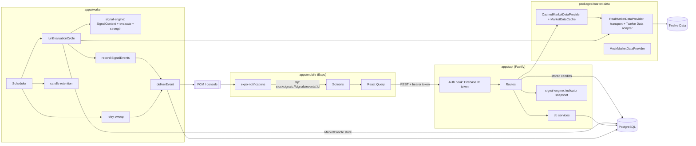
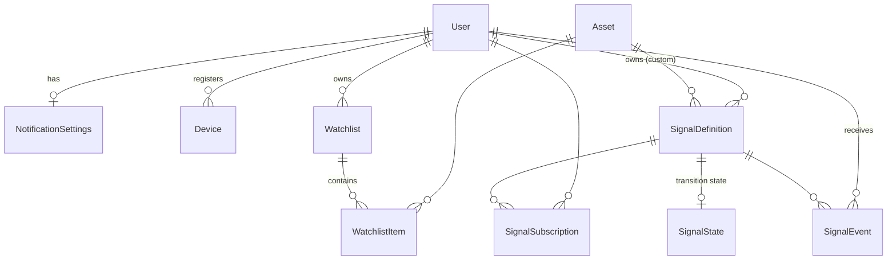
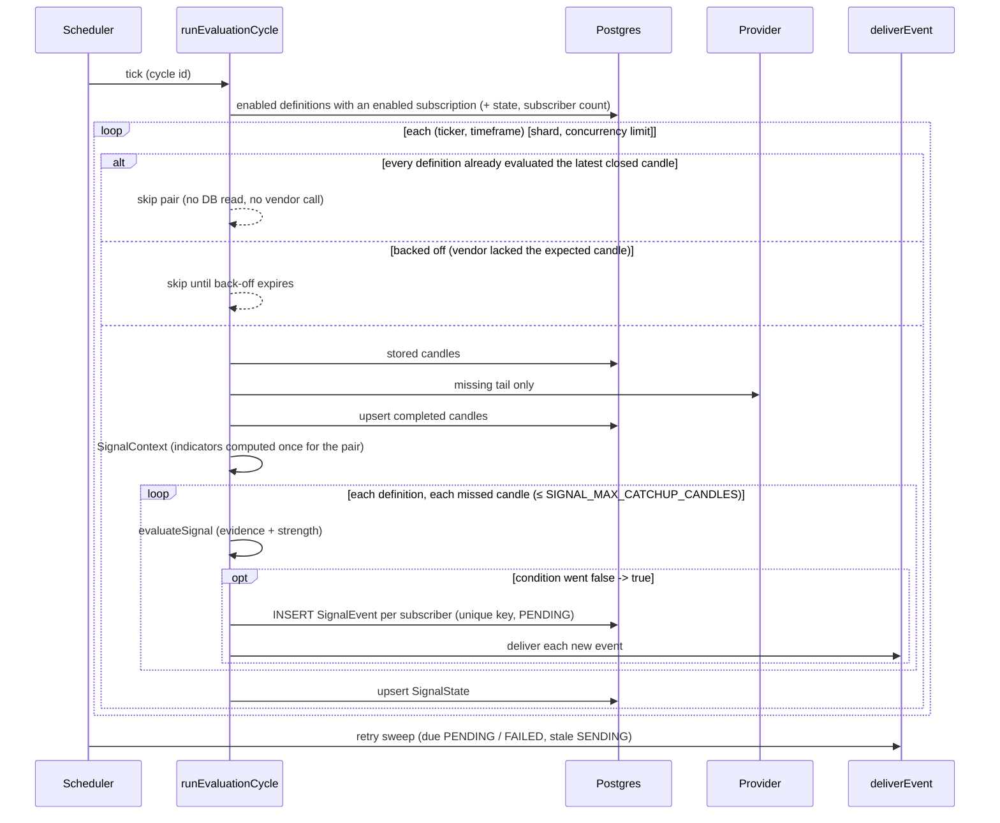

# Architecture

## Overview



Signal calculation happens only on the server. The app displays what the API computes and
builds explanations from structured evidence.

## Packages and dependency direction

```
types  <-  signal-engine  <-  db  <-  api, worker
types  <-  market-data                <-  api, worker
types  <-  config                     <-  api, worker
types  <-  notifications              <-  api, worker
types  <-  mobile (types only)
```

| Package                  | Responsibility                                                                                                                                                             |
| ------------------------ | -------------------------------------------------------------------------------------------------------------------------------------------------------------------------- |
| `@signals/types`         | Domain types and zod schemas: `Quote`, `NormalizedCandle`, `SignalEvidence`, `SignalStrength`, DTOs. The schemas drive API validation, response serialisation and OpenAPI. |
| `@signals/signal-engine` | Pure code with no I/O: indicators, the rule registry, `SignalContext`, `evaluateSignal()` (with evidence), and `scoreSignal()` (strength).                                 |
| `@signals/market-data`   | The vendor-neutral `MarketDataProvider`, the Twelve Data adapter, reliability transport, cache and freshness. Vendor formats never leave this package.                     |
| `@signals/db`            | Prisma schema and migrations, plus domain services: watchlist, presets, signals, events and the candle store.                                                              |
| `@signals/notifications` | The `NotificationSender` (console, FCM, recording), the signal payload builder, and quiet-hours time maths.                                                                |
| `@signals/config`        | Environment variables validated with zod, production guards, log redaction paths, and the retention safety check.                                                          |

Workspace packages ship TypeScript source. `tsx`, Vitest and Metro consume it directly;
`tsup` bundles it into the API and worker `dist/` for production.

## Data model



| Model                  | Purpose                                                                                                     | Key constraints and indexes                                                                                                                                                                     |
| ---------------------- | ----------------------------------------------------------------------------------------------------------- | ----------------------------------------------------------------------------------------------------------------------------------------------------------------------------------------------- |
| `SignalDefinition`     | **What** to evaluate: ticker, timeframe, type, parameters. Either a shared preset or a user's custom alert. | `presetKey` unique; `(ticker, timeframe, enabled)`                                                                                                                                              |
| `SignalSubscription`   | **Who** receives it, plus a per-user `enabled` switch                                                       | unique `(userId, signalDefinitionId)`; `(signalDefinitionId, enabled)`                                                                                                                          |
| `SignalState`          | The condition's value at the last evaluated completed candle                                                | PK `signalDefinitionId`                                                                                                                                                                         |
| `SignalEvent`          | History: message, price, `values`, **`evidence`**, **strength**, and the notification state machine         | **unique `(userId, ticker, signalDefinitionId, timeframe, candleTime)`**; `(userId, triggeredAt desc)`; `(userId, ticker, triggeredAt desc)`; `(notificationStatus, nextNotificationAttemptAt)` |
| `MarketCandle`         | Completed candles, shared by the worker and the API                                                         | PK `(symbol, timeframe, time)`                                                                                                                                                                  |
| `NotificationSettings` | Global switch, category switches, quiet hours, timezone, minimum strength                                   | PK `userId`                                                                                                                                                                                     |
| `Device`               | Push tokens, several per user (capped)                                                                      | `token` unique; `(userId)`                                                                                                                                                                      |

A preset is evaluated **once per candle** and its result goes to every subscriber. Adding a
ticker subscribes the user to 15 presets, 7 of them enabled. `SignalEvent.signalDefinitionId`
is `ON DELETE SET NULL`, so history survives when a custom alert is deleted.

### Migrations

| Migration                     | Change                                                                                                                                                                                                            |
| ----------------------------- | ----------------------------------------------------------------------------------------------------------------------------------------------------------------------------------------------------------------- |
| `init`                        | Phase 1 schema                                                                                                                                                                                                    |
| `signal_event_evidence`       | `SignalEvent.evidence JSONB` (null for older events)                                                                                                                                                              |
| `notification_delivery_state` | Hand-written. Renames `DeliveryStatus` to `NotificationStatus` and adds `SENDING`. Renames the delivery columns (data preserved), adds attempt tracking, backfills existing rows, and adds the retry-sweep index. |
| `signal_strength`             | Hand-written. Adds the `SignalStrength` enum and the event strength columns, and converts the unused 0–100 `minimumSignalStrength` integer into the enum. Existing values are mapped, not dropped.                |

`prisma migrate diff --from-migrations … --to-schema-datamodel …` reports no drift between
the migrations and the schema.

### Index review (verified with `EXPLAIN`)

| Query                                | Plan                                                                                                     |
| ------------------------------------ | -------------------------------------------------------------------------------------------------------- |
| A user's watchlist                   | `Watchlist_userId_name_key` → `WatchlistItem_watchlistId_symbol_key`                                     |
| Worker: active definitions           | `SignalDefinition_…_enabled_idx` plus a semi-join on `SignalSubscription_signalDefinitionId_enabled_idx` |
| Fan-out: subscribers of a definition | `SignalSubscription_signalDefinitionId_enabled_idx`                                                      |
| History: recent events for a user    | `SignalEvent_userId_triggeredAt_idx` (ordered, with `LIMIT`)                                             |
| Retry sweep: due notifications       | `SignalEvent_notificationStatus_nextNotificationAttemptAt_idx`                                           |
| Candle window                        | backward scan on `MarketCandle_pkey`                                                                     |
| Retention delete                     | range scan on `MarketCandle_pkey` per `(symbol, timeframe)`                                              |

No further indexes are justified. The retention job deliberately loops per
`(symbol, timeframe)` so it can use the primary key instead of needing a
`(timeframe, time)` index.

## Market data flow

1. **Provider.** `RealMarketDataProvider` = generic transport (timeout, bounded retries with
   backoff and jitter, `Retry-After`, a token-bucket rate limiter, API-key redaction) plus a
   vendor adapter (Twelve Data: endpoints, zod validation, symbol mapping, error
   classification). See [MARKET_DATA.md](MARKET_DATA.md).
2. **Worker.** Each `(ticker, timeframe)` pair loads its stored candles and fetches only the
   missing tail from the vendor, plus 3 overlapping candles to pick up corrections. Completed
   candles are upserted into `MarketCandle`.
3. **API.** The asset screen reads the stored window when it is complete and current. It falls
   back to the cached provider otherwise (for example, for a timeframe no signal uses).
   Candle cache entries expire when the next candle closes.
4. **Freshness.** Quotes and candle series carry a `dataStatus` (`stale`, `ageSeconds`,
   `marketOpen`). Old data only counts as stale while the market is open or its state is unknown.

## Signal evaluation (worker)



### Strict candle completion

`latestClosedCandleOpenTime(now, timeframe, graceMs)` identifies the latest fully closed
candle for each timeframe. A candle counts as closed only once `open + interval +
CANDLE_CLOSE_GRACE_MS` has passed; the grace period allows for vendor publish lag. Signals
never evaluate the in-progress candle, and no rule requests intrabar evaluation. Tests cover
the boundaries at exactly the close, 1 ms before it, and inside the grace window, for 1m,
5m, 15m, 1h and 1d.

### Firing once

Each rule is a **level condition** (for example `EMA9 > EMA21`). An event fires only when
the condition changes from false to true between consecutive completed candles. The previous
value comes from `SignalState` when that state refers to the immediately preceding candle,
so a revised old candle cannot re-fire a signal. An unknown value never fires.

**Catch-up.** If polls were missed (a vendor delay, a slow cycle), up to
`SIGNAL_MAX_CATCHUP_CANDLES` missed candles are evaluated **in order**, so a crossover
on a skipped candle is not lost. Older gaps are skipped to avoid a flood of stale alerts.

### Idempotency

1. **State skip:** a definition never evaluates the same candle twice.
2. **Database uniqueness:** a unique key on `(userId, ticker, signalDefinitionId, timeframe, candleTime)`.
3. **Record, then deliver:** events are inserted before state is updated, and delivery is a
   separate step. A crash at any point either re-evaluates the candle (the unique key absorbs
   the duplicate) or leaves a `PENDING` event for the retry sweep.

### Notification delivery state machine

```
PENDING --(atomic claim)--> SENDING --> SENT
   |                           |------> FAILED --(backoff elapsed)--> claim again
   |                           |------> FAILED (terminal: max attempts / non-retryable / expired)
   |------> SUPPRESSED (preferences at send time)
   |------> PENDING + nextNotificationAttemptAt (deferred by quiet hours; not an attempt)
   |------> NO_DEVICES
```

- **Claim.** A conditional `UPDATE` with optimistic concurrency on `notificationAttempts`.
  Result writes are guarded by the claimed attempt number, so a timed-out claimer cannot
  overwrite a newer attempt.
- **Crash after insert.** The event stays `PENDING` and the sweep delivers it.
- **Crash mid-send.** The `SENDING` claim goes stale after `NOTIFICATION_SENDING_TIMEOUT_MS`
  and is re-claimed. Delivery is **at-least-once**. A duplicate push collapses on the device
  because the FCM `android.notification.tag` and `apns-collapse-id` are set to the event ID.
- **Retries.** Retries resend the **same event** and never create a new one. Backoff is
  30 s, 60 s, 120 s, 240 s (configurable), up to `NOTIFICATION_MAX_ATTEMPTS`.
- **Expiry.** Anything older than `NOTIFICATION_MAX_AGE_MS` is abandoned; a stale alert is
  worse than none.

### Preferences (checked at send time)

| Setting                                                                          | Effect                                                                         |
| -------------------------------------------------------------------------------- | ------------------------------------------------------------------------------ |
| Global alerts off / ticker alerts off / category off / signal (subscription) off | `SUPPRESSED`, with a reason; the event stays in history                        |
| Signal strength below `minimumSignalStrength`                                    | `SUPPRESSED`                                                                   |
| Inside quiet hours (user's IANA timezone, overnight windows, DST)                | **Delayed** until the window ends; the event is visible in history immediately |
| `notificationFrequency` digests                                                  | Stored but not implemented yet; all notifications are real-time                |

### Signal strength

This is informational. It counts how many configured technical conditions agree with the
signal's direction: the trigger, plus volume, RSI side of 50, close vs EMA 50, and MACD
histogram sign. Confirmations that would restate the trigger are excluded.
1 point = LOW, 2 = MEDIUM, 3+ = HIGH. It is **not** expected return or investment quality.
See [SIGNALS.md](SIGNALS.md#signal-strength).

### Scaling

- **Per pair, not per user:** candles are fetched and indicators computed once per
  `(ticker, timeframe)`. Users only add rows to the fan-out.
- **Skip idle pairs:** there is no work until a new candle closes.
- **Several instances:** set `WORKER_SHARD_INDEX` and `WORKER_SHARD_COUNT` to partition
  pairs. Idempotency makes an overlap harmless.
- **Queues later:** the per-pair body and `deliverEvent` are stateless units of work, so
  BullMQ jobs, cron or serverless functions can run them unchanged.

## API

REST with OpenAPI at `/docs` (on by default outside production).

| Method       | Path                                                          | Purpose                                                                                                                              |
| ------------ | ------------------------------------------------------------- | ------------------------------------------------------------------------------------------------------------------------------------ |
| GET          | `/health`                                                     | Liveness only: no dependencies, not rate limited                                                                                     |
| GET          | `/ready`                                                      | Database (with a 2 s timeout) and configuration checks; 503 when not ready. The market-data vendor is deliberately not a dependency. |
| GET          | `/me` · PATCH `/me/settings`                                  | Profile and notification preferences (quiet hours, timezone, minimum strength)                                                       |
| GET/POST     | `/watchlist`                                                  | List with quotes and `dataStatus` / `quoteError` · add                                                                               |
| PATCH/DELETE | `/watchlist/:symbol`                                          | Per-ticker alerts · remove                                                                                                           |
| GET          | `/assets/search?q=`                                           | Vendor symbol search (cached, 30 requests/min)                                                                                       |
| GET          | `/assets/:symbol?timeframe=`                                  | Quote, indicators on completed candles, `dataStatus`, recent events                                                                  |
| GET          | `/assets/:symbol/candles` · `/assets/:symbol/signals`         | Candles · the user's signals                                                                                                         |
| GET/POST     | `/signals` · GET `/signals/catalog`                           | Signals · create custom · catalogue                                                                                                  |
| PATCH/DELETE | `/signals/:id`                                                | Toggle / edit custom · delete custom                                                                                                 |
| GET          | `/signal-events` · `/signal-events/:id`                       | History with evidence, strength and notification status                                                                              |
| POST         | `/devices/register` · `/devices/unregister` · `/devices/test` | Push tokens (capped per user) · test push                                                                                            |

Every request gets an `x-request-id`: a well-formed incoming value is kept, otherwise a UUID
is generated. The ID appears on every log line for that request.

## Mobile

- Uses expo-router. `/signals/events/[eventId]` is the notification deep-link target, and
  `/event/[id]` redirects there for old links.
- React Query handles caching, pull-to-refresh and light polling. Loading states are skeletons.
- The API token getter is registered during render, before any screen queries, and a 401 is
  retried once with a force-refreshed Firebase token before the app signs out.
- The push token is registered on start, re-registered when the OS rotates it, and
  unregistered on sign-out.

## Designed for later

| Feature                    | Extension point                                                                   |
| -------------------------- | --------------------------------------------------------------------------------- |
| Another market-data vendor | Add a new `VendorAdapter`; the transport, cache and API stay unchanged            |
| Redis cache                | Implement `MarketDataCache` (async, JSON values)                                  |
| Queue workers              | Run the per-pair evaluation and `deliverEvent` as jobs                            |
| Digest notifications       | Leave events `PENDING` with a digest schedule; the sweep batches them per user    |
| Backtesting                | The engine is pure; replay `MarketCandle` history through `evaluateSignal(index)` |
| TradingView webhooks       | Record `SignalEvent`s through the same fan-out and delivery path                  |
| AI explanations            | `SignalEvent.evidence` holds the structured input                                 |
