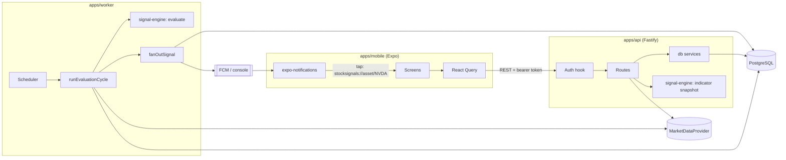
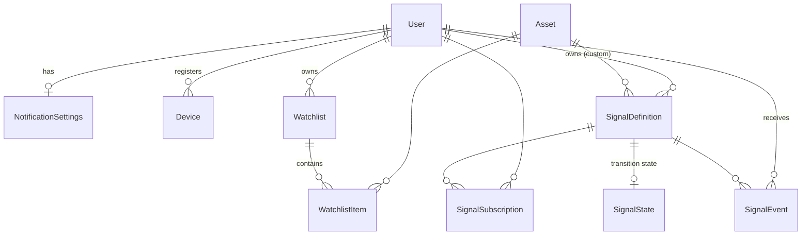
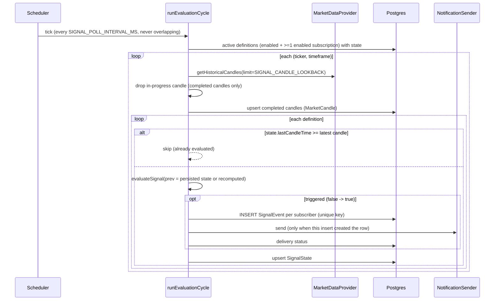

# Architecture

## Overview



Signal calculation lives only on the server. The app displays what the API computes.

## Packages and dependency direction

```
types  <-  signal-engine  <-  db  <-  api, worker
types  <-  market-data                <-  api, worker
types  <-  config                     <-  api, worker
types  <-  notifications              <-  api, worker
types  <-  mobile (types only)
```

- **`@signals/types`**: domain types and zod schemas. The API uses the schemas for request
  validation, response serialisation, and OpenAPI generation. The app uses the same types.
- **`@signals/signal-engine`**: pure functions with no I/O. It contains the indicators, the
  rule registry, and `evaluateSignal()`. Because it has no I/O, the same code can later run
  backtests over stored `MarketCandle` history.
- **`@signals/market-data`**: the vendor abstraction (see [MARKET_DATA.md](MARKET_DATA.md)).
- **`@signals/db`**: the Prisma schema plus domain services (watchlist, presets, signals,
  events). The API, worker, seed, and demo all share this logic.
- **`@signals/notifications`**: the `NotificationSender` interface and its console, FCM, and
  recording adapters.
- **`@signals/config`**: environment variables parsed with zod, including production guards.

Workspace packages ship TypeScript source (`main: src/index.ts`). `tsx`, Vitest, and Metro
consume it directly; `tsup` bundles it into the API and worker `dist/` for production.

## Data model



| Model                | Purpose                                                                                                                                   | Key constraints and indexes                                                                                                                  |
| -------------------- | ----------------------------------------------------------------------------------------------------------------------------------------- | -------------------------------------------------------------------------------------------------------------------------------------------- |
| `SignalDefinition`   | **What** to evaluate: ticker, timeframe, type, parameters. A **preset** (`ownerId` null, shared) or a **custom** alert (owned by a user). | `presetKey` unique; `(ticker, timeframe, enabled)` for the worker                                                                            |
| `SignalSubscription` | **Who** receives it, with a per-user `enabled` flag                                                                                       | unique `(userId, signalDefinitionId)`; `(signalDefinitionId, enabled)`                                                                       |
| `SignalState`        | Condition value at the last evaluated completed candle                                                                                    | PK `signalDefinitionId`                                                                                                                      |
| `SignalEvent`        | History and audit: message, price, indicator values, delivery status                                                                      | **unique `(userId, ticker, signalDefinitionId, timeframe, candleTime)`**; `(userId, triggeredAt desc)`; `(userId, ticker, triggeredAt desc)` |
| `MarketCandle`       | Ingested completed candles                                                                                                                | PK `(symbol, timeframe, time)` also serves range queries                                                                                     |
| `WatchlistItem`      | Ticker membership; `alertsEnabled` per ticker                                                                                             | unique `(watchlistId, symbol)`                                                                                                               |
| `Device`             | Push tokens                                                                                                                               | `token` unique (re-registering moves it to the current user)                                                                                 |

Why split definitions from subscriptions? A preset such as "NVDA 1m EMA 9/21 bullish" is
evaluated **once per candle**, however many users follow NVDA, and the result is then sent
to each subscriber. Custom alerts (for example "price above $190") are ordinary definitions
owned by one user.

Adding a ticker subscribes the user to all 15 presets for it; 7 are enabled by default (see
`PRESET_SIGNALS` in `packages/db/src/services/presets.ts`). The Signals screen is therefore
just a set of toggles, and the worker evaluates only definitions that have at least one
enabled subscription.

`SignalEvent.signalDefinitionId` is nullable (`ON DELETE SET NULL`), so history survives
when a custom alert is deleted. The event stores a snapshot of the name and type.

## Signal evaluation (worker)



### Firing once (transition tracking)

Every rule is a **level condition** evaluated per candle, for example `EMA9 > EMA21`. The
engine fires only when that condition changes from false to true between consecutive
**completed** candles:

```
previous candle: EMA9 <= EMA21   (false)
current  candle: EMA9 >  EMA21   (true)   -> EMA bullish crossover fires
next     candle: EMA9 >  EMA21   (true)   -> nothing (still true)
```

The previous value comes from `SignalState` when the state refers to the immediately
preceding candle. Using the stored value means a vendor revising an old candle cannot make an
already-fired signal fire again. If there is a gap (the first run, or downtime), the previous
value is recomputed from the candles. An unknown value (not enough history) never fires, so a
newly created alert whose condition is already true waits for the next genuine transition.

After downtime only the latest completed candle is evaluated. Missed candles are not replayed,
to avoid a burst of stale alerts.

### Idempotency: three layers

1. **State skip**: a candle already evaluated for a definition is not evaluated again.
2. **Database uniqueness**: `(userId, ticker, signalDefinitionId, timeframe, candleTime)`.
   A duplicate insert fails with `P2002` and is counted as a duplicate.
3. **Notify only on insert**: only the process whose insert created the row sends the push.
   Events are written **before** state, so a crash between the two steps just re-evaluates
   the candle, and layer 2 absorbs the duplicate.

The worker tests cover each layer, including three cycles running concurrently.

### Notification rules

| Condition                                                 | Result                                           |
| --------------------------------------------------------- | ------------------------------------------------ |
| Subscription disabled (a per-signal toggle)               | Not evaluated or recorded for that user          |
| Global alerts off / ticker alerts off / category disabled | Event recorded, `SUPPRESSED` with a reason       |
| No registered devices                                     | Event recorded, `NO_DEVICES`                     |
| Send succeeded on at least one device                     | `SENT`                                           |
| All sends failed                                          | `FAILED`; permanently invalid tokens are deleted |

`quietHours`, `timezone`, `notificationFrequency`, and `minimumSignalStrength` are stored
and returned now so clients can be built against them; the worker does not enforce them yet.

### Scaling path

`runEvaluationCycle()` is stateless between calls; all state lives in Postgres. To scale:

- **Cron or serverless:** call `runEvaluationCycle()` from a scheduled function (use `--once` for
  a single cycle).
- **BullMQ + Redis:** a repeatable "fan-out" job enqueues one job per `(ticker, timeframe)`,
  and workers run the per-pair body (`evaluatePair`). The unique constraint already makes
  concurrent workers safe.
- **Per-timeframe cadence:** schedule 1m pairs every minute and 1h pairs hourly by filtering
  definitions by timeframe; the candle-close timestamp logic (`candleOpenTime`,
  `isCandleComplete`) already works for every timeframe.
- **Real-time:** a WebSocket provider can call the same per-pair evaluation when a candle closes.

## API

REST with OpenAPI at `/docs` (JSON at `/docs/json`). Main routes:

| Method       | Path                                                          | Purpose                                                   |
| ------------ | ------------------------------------------------------------- | --------------------------------------------------------- |
| GET          | `/health`                                                     | Liveness, DB check, provider name (public)                |
| GET          | `/me` · PATCH `/me/settings`                                  | Profile and notification settings                         |
| GET/POST     | `/watchlist`                                                  | List (with quotes) / add (idempotent; subscribes presets) |
| PATCH/DELETE | `/watchlist/:symbol`                                          | Per-ticker alerts / remove                                |
| GET          | `/assets/search?q=`                                           | Symbol search                                             |
| GET          | `/assets/:symbol`                                             | Quote, indicators (completed candles), recent events      |
| GET          | `/assets/:symbol/candles` · `/assets/:symbol/signals`         | Candle history / the user's signals for the ticker        |
| GET          | `/signals` · `/signals/catalog`                               | The user's signals / all signal types and defaults        |
| POST         | `/signals`                                                    | Create a custom signal (validated parameters)             |
| PATCH/DELETE | `/signals/:id`                                                | Toggle, edit (custom only) / delete (custom only)         |
| GET          | `/signal-events` · `/signal-events/:id`                       | History (cursor pagination) / one event                   |
| POST         | `/devices/register` · `/devices/unregister` · `/devices/test` | Push tokens / test push                                   |

## Mobile

- expo-router file-based navigation: `(tabs)` holds Watchlist, History, and Settings;
  `search` is a modal; `asset/[symbol]`, `asset/[symbol]/signals`, and `event/[id]` are stack screens.
- React Query handles caching, pull-to-refresh, and light polling (15 s for watchlist and asset, 20 s for history).
- Tapping a notification reads `data.ticker` and opens `/asset/<ticker>`, including on cold start.
- Explainability: an event card shows the category ("Momentum signal"), the plain-language
  message, and the key numbers (price, RSI, volume vs average). The event screen lists every
  recorded indicator value and what the signal measures.

## Designed for later

| Future feature                        | Extension point                                                                                  |
| ------------------------------------- | ------------------------------------------------------------------------------------------------ |
| Crypto, Thai equities, forex, indices | `AssetClass` exists end to end; provider per venue; mock already includes `BTC-USD` and `PTT.BK` |
| New indicators or strategies          | Add a rule to `SIGNAL_RULES`; the catalog, API validation, and UI pick it up                     |
| Multi-timeframe signals               | Definitions carry `timeframe`; the worker groups by `(ticker, timeframe)`                        |
| Backtesting                           | The engine is pure; replay `MarketCandle` history through `evaluateSignal`                       |
| TradingView webhooks                  | A new route that writes `SignalEvent`s through the same `fanOutSignal`                           |
| Earnings, news, fundamentals          | New `SignalCategory` values plus rules that consume non-candle inputs                            |
| AI explanations                       | `SignalEvent.values` holds structured inputs for generating explanations                         |
| Real-time data                        | Provider streaming, with per-pair evaluation on candle close                                     |
