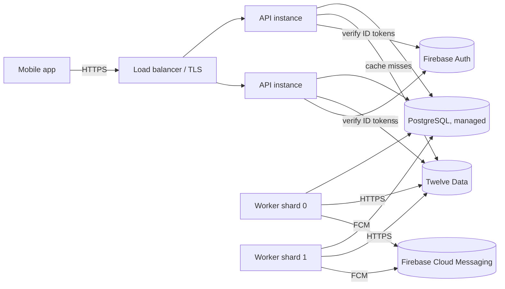

# Production guide

This guide covers running the API, worker and mobile app with real data, real authentication
and real push notifications.

> **Informational/educational product.** Signals are automatically detected technical
> conditions, not investment advice. Keep the in-app disclaimers.

## Deployment topology



| Component              | How to run it                                                             | Scaling                                                                                                                                                                                                                      |
| ---------------------- | ------------------------------------------------------------------------- | ---------------------------------------------------------------------------------------------------------------------------------------------------------------------------------------------------------------------------- |
| API (`apps/api`)       | `pnpm build` → `node apps/api/dist/server.js`                             | Stateless: scale horizontally behind a load balancer. Liveness `GET /health`, readiness `GET /ready`.                                                                                                                        |
| Worker (`apps/worker`) | `node apps/worker/dist/main.js`                                           | Start with one instance. For more, run N instances with `WORKER_SHARD_INDEX=0..N-1` and `WORKER_SHARD_COUNT=N`. Duplicate protection makes an accidental overlap harmless. Liveness is `WORKER_HEALTH_PORT` → `GET /health`. |
| PostgreSQL             | Managed service (RDS, Cloud SQL, Neon, …) with PITR backups               | Vertical first; add a read replica for history reads if needed                                                                                                                                                               |
| Migrations             | Run once per release, **before** new app versions start: `pnpm db:deploy` | –                                                                                                                                                                                                                            |

Each process has its own in-memory market-data cache and rate-limit budget. Split the vendor
quota: `MARKET_DATA_RATE_LIMIT_PER_MINUTE` × (number of processes) must not exceed your plan.
For many API instances, implement `MarketDataCache` on Redis (see `packages/market-data/src/cache.ts`).

## Required environment variables

The processes validate their configuration at startup and refuse to start with a list of
problems. Production (`NODE_ENV=production`) additionally **rejects**: `AUTH_MODE=dev`,
`CORS_ORIGINS=*`, `MARKET_DATA_PROVIDER=mock` (unless `ALLOW_MOCK_MARKET_DATA=true`),
`TRUST_PROXY=true`, and retention shorter than the signal lookback. It turns API docs off
unless `ENABLE_API_DOCS=true`.

| Variable                                                                                                         | Used by     | Production value                                                                    |
| ---------------------------------------------------------------------------------------------------------------- | ----------- | ----------------------------------------------------------------------------------- |
| `NODE_ENV`                                                                                                       | all         | `production`                                                                        |
| `DATABASE_URL`                                                                                                   | all         | Managed Postgres URL (with `sslmode=require` if your provider needs it)             |
| `LOG_LEVEL`                                                                                                      | all         | `info`                                                                              |
| `AUTH_MODE`                                                                                                      | API         | `firebase`                                                                          |
| `FIREBASE_PROJECT_ID`                                                                                            | API, worker | Your Firebase project ID                                                            |
| `FIREBASE_SERVICE_ACCOUNT_BASE64` **or** `FIREBASE_SERVICE_ACCOUNT_PATH` **or** `GOOGLE_APPLICATION_CREDENTIALS` | API, worker | Service account (secret manager)                                                    |
| `AUTH_REQUIRE_EMAIL_VERIFIED`                                                                                    | API         | `true` recommended                                                                  |
| `AUTH_CHECK_REVOKED`                                                                                             | API         | `true` if you revoke sessions (one extra Firebase call per request)                 |
| `CORS_ORIGINS`                                                                                                   | API         | Explicit origins; the native app does not need CORS                                 |
| `TRUST_PROXY`                                                                                                    | API         | Load balancer hop count (e.g. `1`) or its CIDRs                                     |
| `RATE_LIMIT_MAX`, `RATE_LIMIT_WINDOW_MS`                                                                         | API         | Per client IP (default 120/min)                                                     |
| `ENABLE_API_DOCS`                                                                                                | API         | `false` (default in production)                                                     |
| `NOTIFICATION_DRIVER`                                                                                            | worker      | `fcm`                                                                               |
| `MARKET_DATA_PROVIDER` / `MARKET_DATA_VENDOR`                                                                    | API, worker | `real` / `twelvedata`                                                               |
| `MARKET_DATA_API_KEY`                                                                                            | API, worker | Secret                                                                              |
| `MARKET_DATA_DELAYED`                                                                                            | API, worker | Match your plan                                                                     |
| `MARKET_DATA_RATE_LIMIT_PER_MINUTE`                                                                              | API, worker | Plan quota ÷ number of processes                                                    |
| `SIGNAL_DEFAULT_TIMEFRAME`                                                                                       | API         | e.g. `5m` or `15m`                                                                  |
| `SIGNAL_POLL_INTERVAL_MS`                                                                                        | worker      | e.g. `15000` (pairs are skipped until a candle closes)                              |
| `CANDLE_CLOSE_GRACE_MS`                                                                                          | API, worker | `5000`; raise it if your vendor publishes bars late                                 |
| `WORKER_SHARD_INDEX` / `WORKER_SHARD_COUNT`                                                                      | worker      | `0` / `1` unless sharded                                                            |
| `WORKER_HEALTH_PORT`                                                                                             | worker      | e.g. `9100` for liveness probes                                                     |
| `NOTIFICATION_*`                                                                                                 | worker      | Defaults are sensible (5 attempts, 30 s base backoff, 24 h max age)                 |
| `NOTIFICATION_DELIVERY_CONCURRENCY`                                                                              | worker      | `8` (push requests in flight per worker)                                            |
| `MARKET_SESSION_MODE`                                                                                            | API, worker | `regular` (US equities, 09:30–16:00 ET); `extended` needs a plan with pre/post data |
| `METRICS_TOKEN`                                                                                                  | API         | ≥ 16 random characters to enable `GET /metrics`; unset disables it                  |
| `METRICS_LOG_INTERVAL_MS`                                                                                        | worker      | `300000` (metrics snapshot in the logs); `0` = off                                  |
| `CANDLE_RETENTION_DAYS_*`                                                                                        | worker      | Defaults: 1m 7 d, 5m 60 d, 15m 180 d, 1h 730 d, 1d forever                          |

Every variable, with comments, is in [`.env.example`](../.env.example).

## Firebase setup

1. Create a Firebase project. Enable **Authentication → Sign-in method → Email/Password**,
   and optionally **Google**.
2. **Service account** (Project settings → Service accounts → Generate new private key).
   Store it in your secret manager and provide it as `FIREBASE_SERVICE_ACCOUNT_BASE64`
   (`base64 -w0 key.json`). Never commit it. Malformed values are reported without echoing
   their contents.
3. **Mobile web config** (Project settings → Your apps → Web app). Set
   `EXPO_PUBLIC_FIREBASE_API_KEY`, `_AUTH_DOMAIN`, `_PROJECT_ID` and `_APP_ID` in the
   mobile build environment. These are identifiers, not secrets.
4. **Google sign-in (optional).** Create OAuth client IDs (web, iOS, Android) in Google Cloud
   and set `EXPO_PUBLIC_GOOGLE_WEB_CLIENT_ID`, `_IOS_CLIENT_ID` and `_ANDROID_CLIENT_ID`.
   The button appears only when these are set. The API needs no change: Google sign-in
   produces a normal Firebase ID token.
5. **Push.** Add the Android app (package ID) and download `google-services.json` into
   `apps/mobile/` (it is git-ignored). For iOS, see
   [NOTIFICATIONS.md](NOTIFICATIONS.md#ios-not-yet-complete).

## Market-data configuration

1. Create a Twelve Data account and choose a plan whose licence covers your use:
   **showing** prices and alerts to end users may require a commercial or display licence
   (see [MARKET_DATA.md](MARKET_DATA.md#licensing-limits-and-delays)).
2. Set `MARKET_DATA_PROVIDER=real`, `MARKET_DATA_VENDOR=twelvedata` and `MARKET_DATA_API_KEY`.
3. Set `MARKET_DATA_DELAYED` and `MARKET_DATA_RATE_LIMIT_PER_MINUTE` to match the plan.

### Verify market data

The adapter is tested against documented response fixtures but **has not yet been run
against the live API**. Before launch, run the smoke test with the real key:

```bash
MARKET_DATA_PROVIDER=real MARKET_DATA_VENDOR=twelvedata MARKET_DATA_API_KEY=... \
  pnpm --filter @signals/worker verify:market-data NVDA
pnpm --filter @signals/worker verify:market-data PTT.BK     # if you list SET stocks
```

It checks the quote, completed candles for 1m/5m/15m/1h/1d with freshness, and search. It
makes about 7 vendor requests and never prints the key. If a check fails with `BAD_RESPONSE`,
the vendor's format differs from the fixtures. Update
`packages/market-data/src/vendors/twelvedata.ts` and its fixtures together.

## Database deployment

```bash
DATABASE_URL=... pnpm db:deploy      # applies pending migrations; never use `migrate dev` in prod
```

- Run migrations as a separate release step, before new API and worker versions start. The
  Phase 2 migrations are additive or renames, and preserve existing data.
- Use least-privilege roles: the application role needs DML on the app schema. Only the
  migration role needs DDL.
- **Retention.** The worker prunes `MarketCandle` hourly according to `CANDLE_RETENTION_DAYS_*`.
  With about 50 tickers × 1m, roughly 20k rows per day are written, and 7-day retention
  keeps about 140k rows. `SignalEvent` is user history and is kept. If you need a history
  retention policy, add a scheduled `DELETE … WHERE triggeredAt < …` together with a
  product decision.

## Mobile build configuration

- Set `EXPO_PUBLIC_API_URL` to the public HTTPS API URL.
- Set the Firebase and Google `EXPO_PUBLIC_*` variables above. They are embedded in the
  bundle, so never put secrets there.
- Change `ios.bundleIdentifier` and `android.package` in `apps/mobile/app.config.ts`.
- Build with EAS (`eas build -p android`, or `-p ios`) or with `npx expo prebuild` plus the
  native toolchains. Push notifications require a development or production build; Expo Go
  cannot receive them.
- The deep-link scheme is `stocksignals://`, and notifications open
  `stocksignals://signals/events/<id>`.

## Security checklist

- [ ] `NODE_ENV=production`, `AUTH_MODE=firebase`, `AUTH_REQUIRE_EMAIL_VERIFIED=true`
- [ ] All secrets (service account, `MARKET_DATA_API_KEY`, `DATABASE_URL`) come from a secret manager; none are in the repo or the mobile bundle
- [ ] `CORS_ORIGINS` is explicit; `TRUST_PROXY` matches your load balancer (a hop count or CIDRs, never `true`)
- [ ] TLS is terminated at the load balancer; the API is not reachable directly
- [ ] `ENABLE_API_DOCS=false` (the default), or docs are protected at the edge
- [ ] Rate limits are tuned (`RATE_LIMIT_MAX`); search is 30/min per IP and the test push is 5/min
- [ ] `MARKET_DATA_BASE_URL` is unset, or on the vendor allowlist (`MARKET_DATA_ALLOW_CUSTOM_BASE_URL` only for your own egress proxy)
- [ ] Logs go to your aggregator; spot-check that no `authorization`, token or key values appear (they are redacted by `LOG_REDACT_PATHS`)
- [ ] The database is reachable only from the app network, with encrypted storage and backups
- [ ] Firebase: the Auth domain allowlist is set, and unused sign-in providers are disabled
- [ ] Dependency and image scanning is in CI

Already enforced in code: zod validation on every input, including character sets for
symbols, searches and push tokens; per-user data scoping; a 64 KB body limit; helmet
headers; bearer tokens over 4 KB are rejected; dev auth is refused in production at both the
config and app level; push payloads carry identifiers only.

## Monitoring

**Logs** are structured JSON (pino).

- API lines carry `requestId`, which is also returned as `x-request-id`.
- Worker cycle and pair lines carry `evaluationCycleId`, `symbol`, `timeframe`,
  `subscriptionsEvaluated`, `eventsCreated`, `notificationsSent` and `durationMs`.

**Metrics.** Counters, gauges and timings are kept in memory per process and are exposed
as JSON or Prometheus text (`?format=prometheus`):

- API: `GET /metrics` with `Authorization: Bearer $METRICS_TOKEN` (the route does not exist
  without a token). `http_requests_total{route,status}`, `http_request_duration_ms`,
  `market_data_cache_hits_total{kind}` / `market_data_cache_misses_total{kind}` and the
  market-data series below.
- Worker: `GET :WORKER_HEALTH_PORT/metrics` (internal port), plus a `metrics snapshot` log
  line every `METRICS_LOG_INTERVAL_MS`.

| Metric                                                                                                                                       | Meaning                                         |
| -------------------------------------------------------------------------------------------------------------------------------------------- | ----------------------------------------------- |
| `worker_cycles_total`, `worker_cycle_failures_total`, `worker_cycle_duration_ms`                                                             | Cycles run, crashed, and how long they take     |
| `market_data_requests_total{vendor,operation,ok}`, `market_data_request_failures_total{code}`, `market_data_request_duration_ms`             | Vendor calls, failures by code, latency         |
| `candle_store_hits_total` / `candle_store_misses_total`                                                                                      | Pairs served from `MarketCandle` vs fetched     |
| `worker_pairs_evaluated_total`, `worker_pairs_skipped_total{reason}`                                                                         | Pairs evaluated; skipped (up to date / backoff) |
| `signals_triggered_total`, `signal_events_created_total`, `signal_events_duplicate_total`                                                    | Triggers, events recorded, duplicates absorbed  |
| `notifications_sent_total`, `notification_retries_total`, `notification_failures_total{permanent}`, `notification_deliveries_total{outcome}` | Push outcomes                                   |
| `notifications_pending` (gauge)                                                                                                              | Events waiting to be (re)sent or mid-send       |

Counters reset when a process restarts; alert on rates, not absolute values.

Suggested alerts:

| Signal           | Source                                                                                                               | Alert when                                                      |
| ---------------- | -------------------------------------------------------------------------------------------------------------------- | --------------------------------------------------------------- |
| API not ready    | `GET /ready` → 503                                                                                                   | For longer than 1 minute                                        |
| Worker stuck     | `GET :WORKER_HEALTH_PORT/health` → 503                                                                               | Any (no successful cycle within 5 poll intervals)               |
| Cycle errors     | `evaluation cycle complete` with `errors > 0`                                                                        | Sustained                                                       |
| Stale data       | cycle `stalePairs > 0` while markets are open; API `dataStatus.stale`                                                | Sustained for longer than a few candles                         |
| Vendor problems  | `market data request failed` logs by `code` (`RATE_LIMITED`, `UNAUTHORIZED`, `UPSTREAM_UNAVAILABLE`)                 | Any `UNAUTHORIZED` or `FORBIDDEN`; a rising `RATE_LIMITED` rate |
| Push failures    | `notification failed permanently`; count of `SignalEvent` rows with `FAILED` and `nextNotificationAttemptAt IS NULL` | Rising                                                          |
| Delivery backlog | count of `PENDING`/`FAILED` events with `nextNotificationAttemptAt < now() - 5 min`                                  | More than 0 for longer than 10 minutes                          |
| Cycle duration   | `durationMs`                                                                                                         | Approaching `SIGNAL_POLL_INTERVAL_MS`                           |

## Backup strategy

- **PostgreSQL** is the only stateful component. Enable managed **point-in-time recovery**,
  with 7–35 days of WAL retention, plus daily snapshots copied to another region or account.
- **Restore drill:** restore quarterly into a staging database, run `pnpm db:deploy`, and run
  the API against it (`GET /ready`).
- **Rebuildable data:** `MarketCandle` can be re-fetched from the vendor within the plan's
  history limits. `SignalEvent` history, users, watchlists, subscriptions and settings
  cannot, so they are what the backups protect.
- **Secrets** (service account, API keys) live in the secret manager, which has its own
  versioning. Firebase Auth user records are held by Firebase.

## Manual setup still required

These steps need credentials, devices or accounts that the development environment did not
have. They are implemented and tested with mocks and fixtures, but have **not** been run for
real. [REAL_WORLD_VALIDATION.md](REAL_WORLD_VALIDATION.md) lists exactly what was and was not
validated, the scripts that validate each item once credentials exist, the Android device
protocol, and the beta release gate.

1. **Twelve Data:** get a key and run `verify:market-data` against the live API (see above).
2. **Firebase Auth:** create the project and service account, set the variables, and sign
   up on a real device. Verify that the API accepts the ID token (the tests use a mocked
   verifier).
3. **Google sign-in:** create the OAuth clients, set the `EXPO_PUBLIC_GOOGLE_*` variables,
   and test on devices.
4. **FCM (Android):** add `google-services.json`, build a development build, register the
   device, and send a test push. Then trigger a real signal and confirm that tapping it opens
   the event screen.
5. **iOS push:** add `@react-native-firebase/messaging` (not implemented) and upload the
   APNs key.
6. **Licensing:** confirm your market-data plan allows showing data and alerts to your users.
